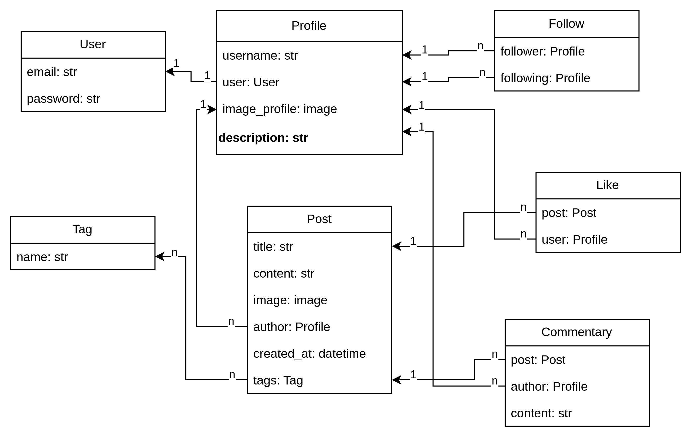

# Social-media-API


## Description

Social-media-API is a Django-based application that provides a comprehensive REST API for social media functionality. It enables 
user interaction through posts, comments, likes, and following systems, with robust authentication and user management capabilities.

## Features

- Authentication system with JWT tokens
- User registration and profile management
- Create, retrieve, update, and delete posts with media attachments
- Social interactions (likes, comments, following)
- Post filtering and search functionality
- User following/follower system
- Feed generation for followed users' posts
- API documentation with Swagger/OpenAPI
- Pagination for optimal performance

## Tech Stack

- Python 3.11
- Django & Django REST Framework
- PostgreSQL database
- JWT for authentication
- drf-spectacular for API documentation
- Docker & Docker Compose for containerization
- Celery and Redis for creating scheduled posts

## How to Start

To get started with this project using Docker Compose, follow these steps:

### Prerequisites

- Ensure you have Docker and Docker Compose installed on your machine.

### Steps to Run the API

1. Clone the repository:
   ```bash
   git clone <repository-url>
   cd <repository-folder>
   ```
   
2. Set environment variables in `.env` using `.env.sample`

    ```
    SECRET_KEY=<django secret key>
    DEBUG=<True or False>
    CELERY_BROKER_URL=<celery broker url>
    POSTGRES_DB=<postgres db name>
    POSTGRES_USER=<postgres db use>
    POSTGRES_PASSWORD=<postgres db password>
    POSTGRES_HOST=<posgres db host>
    POSTGRES_PORT=5432
    PGDATA=/var/lib/postgresql/data
    ```

3. Build and run the containers:
   ```bash
   docker-compose up --build
   ```

4. Access the application:

    - Base path: `http://0.0.0.0:8000`
    - API: `http://0.0.0.0:8000/api/v1/social-media`
    - Registration: `http://0.0.0.0:8000/api/v1/user/register`
    - Admin panel: `http://0.0.0.0:8000/admin`
    - Documentation: `http://0.0.0.0:8000/api/v1/doc/swagger`

### How to register user

1. Send a POST request to `/api/v1/user/register/` with the following JSON body:

   ```json
   {
       "email": "user@example.com",
       "password": "your_password"
   }
   ```
   
2. After registration, obtain your JWT token by sending a POST request to `/api/v1/user/token/`:  

    ```json
    {
        "email": "user@example.com",
        "password": "your_password"
    }
    ```
3. Use the received token in subsequent requests by adding it to the Authorization header:

    `Authorization`: `Bearer <your_token>`

## API Documentation

The API endpoints are structured as follows:

- **Authentication**:
    - Register: `/api/v1/user/register/`
    - Retrieve token: `/api/v1/user/token/`

- **Profile Management**:
    - Profiles: `/api/v1/social-media/profiles/<id>/`
    - My profile: `/api/v1/social-media/profiles/me/`
    - Followings profiles: `/api/v1/social-media/profiles/followings/`
    - Followers profiles: `/api/v1/social-media/profiles/followers/`
    - Follow/Unfollow: `/api/v1/social-media/profiles/<id>/follow/`
 
- **Posts**:
    - Posts: `/api/v1/social-media/posts/<id>/`
    - My posts: `/api/v1/social-media/posts/my-posts/`
    - Posts of users which I follow: `/api/v1/social-media/posts/following_posts/`
    - Liked posts: `/api/v1/social-media/posts/liked/`
    - Like/Unlike a post: `/api/v1/social-media/posts/<id>/like/`

- **Comments**:
    - Add a comment: `/api/v1/social-media/posts/<id>/comment/`
    - Retrieve comments: `/api/v1/social-media/posts/<id>/comment/<id>/`

Detailed documentation can be found at `0.0.0.0:8000/api/v1/doc/swagger/`

## Database structure

